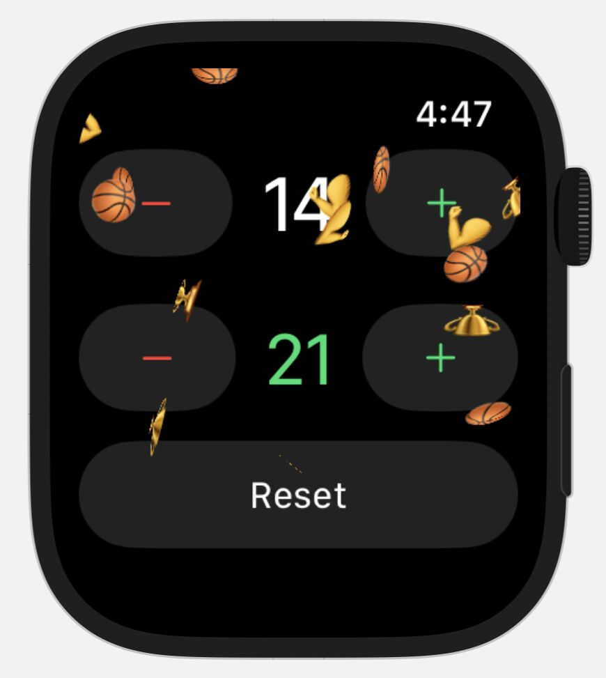
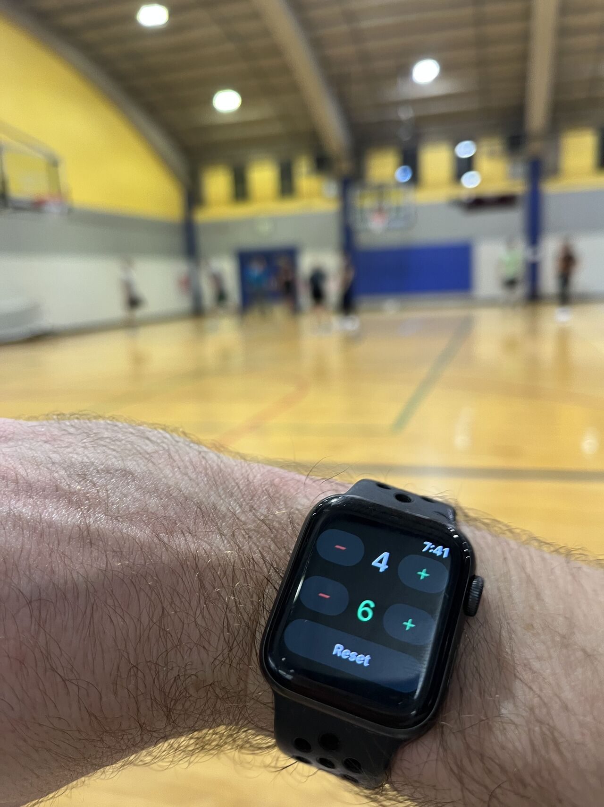

#  Basketball Score Counter

Basketball Score Counter is a dumb simple WatchOS app I built. I hate playing pickup basketball and forgetting the score. It's frustrating and frequently leads to a fight among opponents. I created this as an easy way to keep track of two scores so I can focus all my brain muscles on the game. When one the scores hits 21, confetti falls! 🏀🏆💪

Basketball Score Counter is not on the app store. I didn't want to give Tim Cook the $100. You can clone this repo, run it on Xcode, and [deploy it on your personal Apple Watch](https://stackoverflow.com/questions/29979189/how-to-deploy-build-and-run-app-on-the-apple-watch) for free.

All that "good stuff" in the code is found in [ContentView.swift](<Basketball Score Counter Watch App/ContentView.swift>). 

This is my first Swift project, so don't roast me. Shoutout to [Stanford's CS193p course on Youtube](https://www.youtube.com/watch?v=bqu6BquVi2M) for teaching me the fundamentals.

